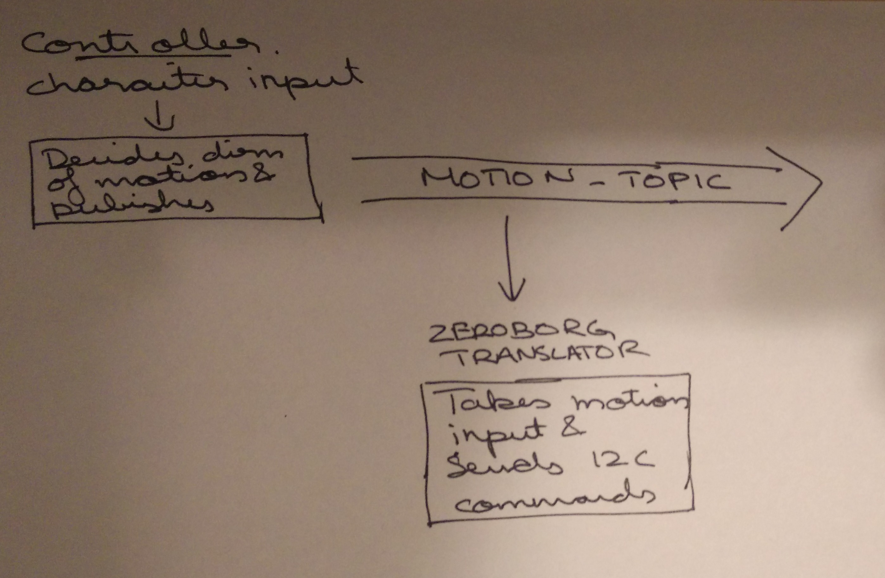

# README

[License](LICENSE)

## Introduction
This project is aimed at creating a robot based on the Beagle Bone Black and a Zeroborg board using the ROS
architecture. The motivations behind this are :

1. Create a software package which is modular so that individual components (like motor drivers) can be easily
replaced.
2. Learn ROS - because I want to
3. Get more experience with Python and Linux programming

## Getting started

1. Install Ubuntu 14.04 on BBB  from instructions on http://charette.no-ip.com:81/programming/2015-06-07_BeagleBoneBlack/
and https://fleshandmachines.wordpress.com/2015/08/25/beaglebone-black-ubuntu-14-04-ros-indigo-install/.

    a. On Windows, use the Win32DiskImage and go to the shortcut file for the application

    b. Select the "Compatibility" section, and check the part to run it
    as a Windows XP SP2 application and as an administrator.

    c. It also helps installing the drivers for BBB from https://learn.adafruit.com/ssh-to-beaglebone-black-over-usb/installing-drivers-windows

2. Plug in the wifi dongle. Modify the following settings (obtained from
https://cdn-learn.adafruit.com/downloads/pdf/setting-up-wifi-with-beaglebone-black.pdf)

    a. Edit the /etc/network/interfaces file to specify WiFi network connection details.
    You will have to "sudo" to actually have priveleges to modify the file

    b. Modify the commented block which looks like below
    ```
    #auto wlan0
    #iface wlan0 inet dhcp
    # wpa-ssid "essid"
    # wpa-psk "password"
    ```
    Uncomment (delete the # for each line) this part and the fill in the
    right ssid and password for the wifi you want to connect to.

    c. Now run `sudo ifup wlan0`.

3. Install ROS Indigo on the BBB based on instructions from https://fleshandmachines.wordpress.com/2015/08/25/beaglebone-black-ubuntu-14-04-ros-indigo-install/.
4. Follow the instructions on the [setup shell script](run_package.sh) on how to get the program started.

## References

1. Installing Ubuntu on the BBB - http://charette.no-ip.com:81/programming/2015-06-07_BeagleBoneBlack/
2. Installing ROS on BBB (the ubuntu img file links do not work here, but ROS installation is straightforward)
- https://fleshandmachines.wordpress.com/2015/08/25/beaglebone-black-ubuntu-14-04-ros-indigo-install/.
3. Zeroborg reference - https://www.piborg.org/zeroborg

## Designs

### Basic Motion Control
