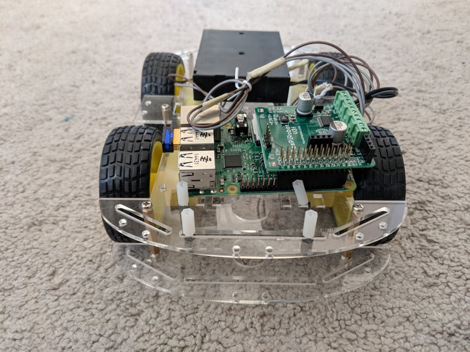

# README

[License](LICENSE)

## Introduction

This project is aimed at creating a robot based running ROS which allows us to turn any generic robot hardware platform into a smart robot.



## Hardware Requirements

1. Raspberry Pi 2 - Could work with the RPi3, but I have not tested it
2. RaspiRobotV3 - https://www.monkmakes.com/rrb3/
3. Power Supply - I have used a 9V supply with 6 AA batteries to ensure we can supply the required power to both boards.
4. Test robot platform - I bought a 20 dollar robot off of ebay. Any platform with DC motors should work.

## Installation

1. Install Ubuntu Core 16 on the RPi 2 - https://developer.ubuntu.com/core/get-started/raspberry-pi-2-3
    a. Dont connect other boards while doing this.
    b. Sufficient power (2A USB) is required for working with the raspberry pi 2.  
    c. Required Libraries - `gcc`, `g++`, `python`, `git`

2. SSH onto the raspberry pi - ssh <user-name>@<ip-address>
      a. Need the private key in ubuntu core account, it should not ask for password(the password does not work)
      b. To get apt-get and other applications, run `sudo classic` to get the classic ubuntu environment.

2. Install the ROS Kinetic using the generic ARM installation - http://wiki.ros.org/kinetic/Installation/Ubuntu]

3. Install the RaspiRobot V3 drivers - https://www.monkmakes.com/rrb3/
    ```
    cd ~
    git clone https://github.com/simonmonk/raspirobotboard3.git
    cd raspirobotboard3/python
    sudo python setup.py install
    ```

4. Clone this repository and run `catkin_make` in the repository.

## Running the program

1. SSH onto the RPi in 3  separate terminal windows.
2. Terminal 1
    a. Start the roscore. `roscore`
3. Terminal 2 
    a. Navigate to the project repo folder.
    b. Run `catkin_make` and then `source ./devel/setup.bash`. 
    c. Run  `rosrun robot_motion_control node_keyboard_motion_controller.py`. This starts the keyboard inputs for controlling the robot.
4. Terminal 3 - 
    a. Navigate to the project repo folder, run `source ./devel/setup.bash`. 
    b. Run `sudo su`. We need to do this as the driver library needs root access to manipulate IOs.
    b. Run  `rosrun rpi_support node_raspirobotv3_driver.py`. This starts the motor control part of the robot.

## References

1. http://wiki.ros.org/ROSberryPi/Installing%20ROS%20Kinetic%20on%20the%20Raspberry%20Pi
2. https://developer.ubuntu.com/core/get-started/developer-setup
3. https://developer.ubuntu.com/core/get-started/raspberry-pi-2-3
4. https://www.monkmakes.com/rrb3/